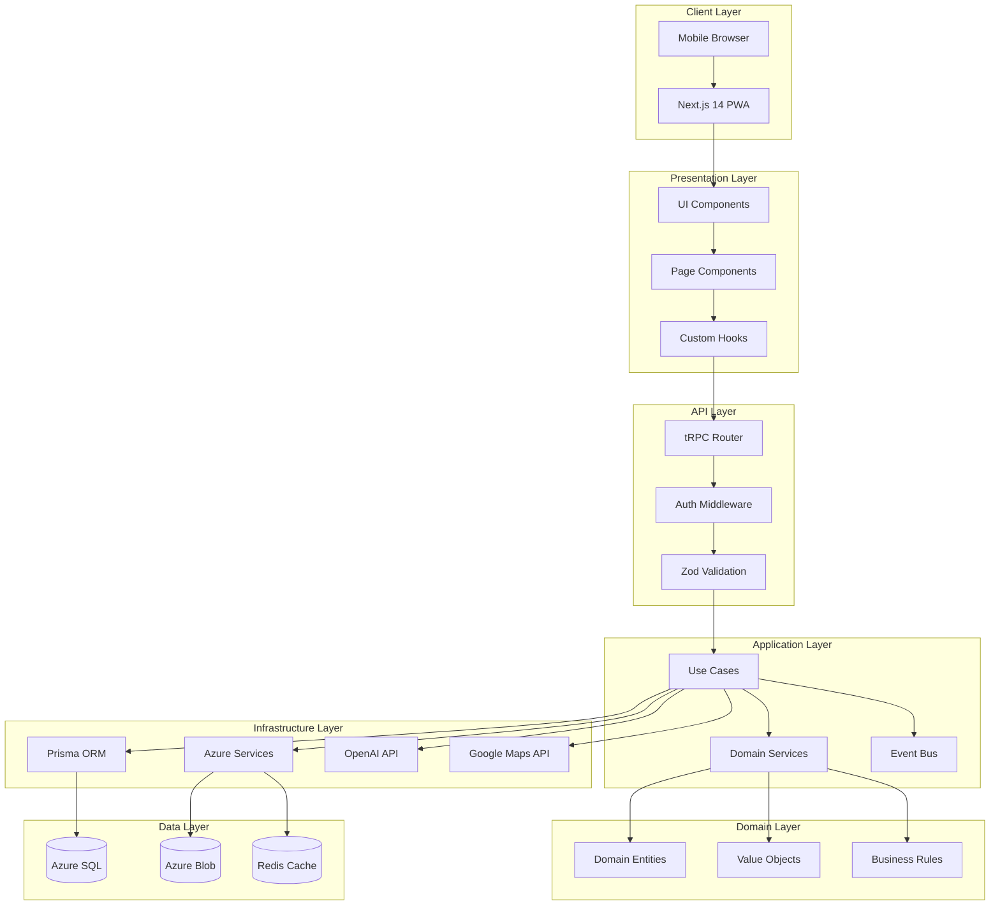
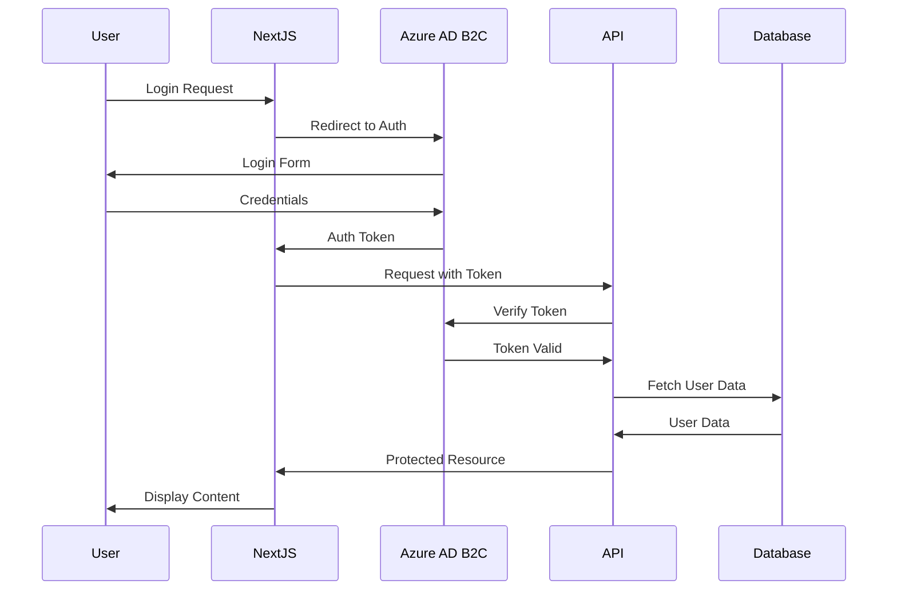

# EI-Expenses System Architecture

## 1. Architectural Overview

### 1.1 Architecture Style
- **Clean Architecture** with Domain-Driven Design (DDD) principles
- **Component-Based Architecture** for maintainability and testability
- **Monorepo Structure** using Turborepo for code sharing and consistency
- **Event-Driven Communication** for decoupled components

### 1.2 Key Design Principles
- **Separation of Concerns**: Clear boundaries between layers
- **Dependency Inversion**: Core domain independent of infrastructure
- **Single Responsibility**: Each component has one reason to change
- **Interface Segregation**: Small, focused interfaces
- **Open/Closed**: Extensible without modification

## 2. System Architecture Diagram



## 3. Project Structure

### 3.1 Monorepo Organization
```
ei-expenses/
├── apps/
│   ├── web/                    # Next.js 14 Frontend Application
│   │   ├── src/
│   │   │   ├── app/           # App Router pages
│   │   │   ├── components/    # Page-specific components
│   │   │   ├── hooks/         # Custom React hooks
│   │   │   ├── lib/           # Client utilities
│   │   │   ├── providers/     # React context providers
│   │   │   └── styles/        # Global styles
│   │   ├── public/            # Static assets
│   │   └── next.config.js
│   │
│   └── worker/                 # Azure Functions
│       ├── src/
│       │   ├── functions/     # Function endpoints
│       │   ├── services/      # Worker services
│       │   └── utils/         # Worker utilities
│       └── host.json
│
├── packages/
│   ├── core/                   # Business Logic & Domain
│   │   ├── src/
│   │   │   ├── domain/        # Domain layer
│   │   │   │   ├── entities/ # Business entities
│   │   │   │   ├── value-objects/
│   │   │   │   ├── events/   # Domain events
│   │   │   │   └── rules/    # Business rules
│   │   │   ├── application/   # Application layer
│   │   │   │   ├── use-cases/
│   │   │   │   ├── services/
│   │   │   │   └── ports/    # Interface definitions
│   │   │   └── infrastructure/
│   │   │       ├── repositories/
│   │   │       └── services/
│   │   └── package.json
│   │
│   ├── api/                    # tRPC API Layer
│   │   ├── src/
│   │   │   ├── routers/       # tRPC routers
│   │   │   ├── middleware/    # API middleware
│   │   │   ├── context/       # tRPC context
│   │   │   └── server.ts      # tRPC server setup
│   │   └── package.json
│   │
│   ├── database/               # Prisma Database Layer
│   │   ├── prisma/
│   │   │   ├── schema.prisma  # Database schema
│   │   │   ├── migrations/    # Migration files
│   │   │   └── seed.ts        # Seed data
│   │   ├── src/
│   │   │   ├── client.ts      # Prisma client
│   │   │   └── repositories/  # Data repositories
│   │   └── package.json
│   │
│   ├── ui/                     # Shared UI Components
│   │   ├── src/
│   │   │   ├── components/    # Reusable components
│   │   │   │   ├── atoms/    # Basic elements
│   │   │   │   ├── molecules/# Composite components
│   │   │   │   └── organisms/# Complex components
│   │   │   ├── hooks/         # Shared hooks
│   │   │   └── utils/         # UI utilities
│   │   └── package.json
│   │
│   └── shared/                 # Shared Types & Utilities
│       ├── src/
│       │   ├── types/         # TypeScript types
│       │   ├── constants/     # Shared constants
│       │   ├── utils/         # Utility functions
│       │   └── schemas/       # Zod schemas
│       └── package.json
│
├── config/                     # Configuration Files
│   ├── eslint/                # ESLint configs
│   ├── typescript/            # TypeScript configs
│   └── jest/                  # Jest configs
│
├── scripts/                    # Build & Deploy Scripts
├── turbo.json                 # Turborepo config
├── package.json               # Root package.json
└── pnpm-workspace.yaml        # PNPM workspace config
```

## 4. Component Architecture

### 4.1 Frontend Components (Atomic Design)

#### Atoms (Basic Building Blocks)
```typescript
// packages/ui/src/components/atoms/button/button.tsx
export interface ButtonProps {
  variant: 'primary' | 'secondary' | 'danger';
  size: 'sm' | 'md' | 'lg';
  onClick?: () => void;
  disabled?: boolean;
  children: React.ReactNode;
}

export const Button: React.FC<ButtonProps> = ({ 
  variant, 
  size, 
  onClick, 
  disabled, 
  children 
}) => {
  // Implementation
};
```

#### Molecules (Combinations of Atoms)
```typescript
// packages/ui/src/components/molecules/form-field/form-field.tsx
export interface FormFieldProps {
  label: string;
  error?: string;
  required?: boolean;
  children: React.ReactNode;
}

export const FormField: React.FC<FormFieldProps> = ({
  label,
  error,
  required,
  children
}) => {
  // Combines Label, Input, and ErrorMessage atoms
};
```

#### Organisms (Complex Components)
```typescript
// packages/ui/src/components/organisms/expense-form/expense-form.tsx
export interface ExpenseFormProps {
  expense?: Expense;
  onSubmit: (data: ExpenseFormData) => Promise<void>;
  onCancel: () => void;
}

export const ExpenseForm: React.FC<ExpenseFormProps> = ({
  expense,
  onSubmit,
  onCancel
}) => {
  // Complex form with multiple fields and logic
};
```

### 4.2 Backend Components (Clean Architecture)

#### Domain Layer
```typescript
// packages/core/src/domain/entities/expense.ts
export class Expense {
  private constructor(
    private readonly id: ExpenseId,
    private readonly userId: UserId,
    private readonly date: Date,
    private readonly type: ExpenseType,
    private readonly amount: Money,
    private readonly description: string,
    private readonly receiptUrl?: string,
    private readonly metadata?: ExpenseMetadata
  ) {}

  static create(props: CreateExpenseProps): Result<Expense> {
    // Business logic validation
    if (!this.isValidAmount(props.amount)) {
      return Result.fail('Invalid amount');
    }
    // Create expense
  }

  // Business methods
  attachReceipt(receiptUrl: string): Result<void> {}
  approve(): Result<void> {}
  reject(reason: string): Result<void> {}
}
```

#### Application Layer (Use Cases)
```typescript
// packages/core/src/application/use-cases/expenses/create-expense.ts
export class CreateExpenseUseCase implements UseCase<CreateExpenseDTO, ExpenseDTO> {
  constructor(
    private expenseRepo: IExpenseRepository,
    private receiptStorage: IReceiptStorage,
    private eventBus: IEventBus
  ) {}

  async execute(request: CreateExpenseDTO): Promise<Result<ExpenseDTO>> {
    // 1. Validate input
    const validationResult = await this.validate(request);
    if (validationResult.isFailure) {
      return Result.fail(validationResult.error);
    }

    // 2. Create domain entity
    const expenseResult = Expense.create({
      userId: request.userId,
      date: request.date,
      type: request.type,
      amount: Money.create(request.amount, request.currency),
      description: request.description
    });

    if (expenseResult.isFailure) {
      return Result.fail(expenseResult.error);
    }

    // 3. Store receipt if provided
    if (request.receiptImage) {
      const receiptUrl = await this.receiptStorage.store(request.receiptImage);
      expenseResult.getValue().attachReceipt(receiptUrl);
    }

    // 4. Persist expense
    await this.expenseRepo.save(expenseResult.getValue());

    // 5. Publish domain event
    await this.eventBus.publish(
      new ExpenseCreatedEvent(expenseResult.getValue())
    );

    // 6. Return DTO
    return Result.ok(ExpenseMapper.toDTO(expenseResult.getValue()));
  }
}
```

#### Infrastructure Layer
```typescript
// packages/database/src/repositories/expense-repository.ts
export class PrismaExpenseRepository implements IExpenseRepository {
  constructor(private prisma: PrismaClient) {}

  async save(expense: Expense): Promise<void> {
    const raw = ExpenseMapper.toPersistence(expense);
    await this.prisma.expense.upsert({
      where: { id: raw.id },
      create: raw,
      update: raw
    });
  }

  async findById(id: string): Promise<Expense | null> {
    const raw = await this.prisma.expense.findUnique({
      where: { id }
    });
    return raw ? ExpenseMapper.toDomain(raw) : null;
  }
}
```

## 5. Component Communication Patterns

### 5.1 Frontend State Management
```typescript
// Using Zustand for global state
// packages/web/src/stores/expense-store.ts
interface ExpenseStore {
  expenses: Expense[];
  loading: boolean;
  error: string | null;
  
  // Actions
  fetchExpenses: () => Promise<void>;
  createExpense: (data: CreateExpenseData) => Promise<void>;
  updateExpense: (id: string, data: UpdateExpenseData) => Promise<void>;
  deleteExpense: (id: string) => Promise<void>;
}

export const useExpenseStore = create<ExpenseStore>((set, get) => ({
  expenses: [],
  loading: false,
  error: null,
  
  fetchExpenses: async () => {
    set({ loading: true, error: null });
    try {
      const expenses = await trpc.expense.list.query();
      set({ expenses, loading: false });
    } catch (error) {
      set({ error: error.message, loading: false });
    }
  },
  // ... other actions
}));
```

### 5.2 Backend Event Bus
```typescript
// packages/core/src/infrastructure/events/event-bus.ts
export class EventBus implements IEventBus {
  private handlers: Map<string, EventHandler[]> = new Map();

  subscribe(eventName: string, handler: EventHandler): void {
    const handlers = this.handlers.get(eventName) || [];
    handlers.push(handler);
    this.handlers.set(eventName, handlers);
  }

  async publish(event: DomainEvent): Promise<void> {
    const handlers = this.handlers.get(event.name) || [];
    await Promise.all(
      handlers.map(handler => handler.handle(event))
    );
  }
}
```

## 6. tRPC Integration Pattern

### 6.1 Router Definition
```typescript
// packages/api/src/routers/expense.ts
export const expenseRouter = router({
  list: protectedProcedure
    .input(z.object({
      page: z.number().default(1),
      limit: z.number().default(10),
      filter: expenseFilterSchema.optional()
    }))
    .query(async ({ ctx, input }) => {
      const useCase = new ListExpensesUseCase(ctx.expenseRepo);
      const result = await useCase.execute({
        userId: ctx.user.id,
        ...input
      });
      
      if (result.isFailure) {
        throw new TRPCError({
          code: 'BAD_REQUEST',
          message: result.error
        });
      }
      
      return result.getValue();
    }),

  create: protectedProcedure
    .input(createExpenseSchema)
    .mutation(async ({ ctx, input }) => {
      const useCase = new CreateExpenseUseCase(
        ctx.expenseRepo,
        ctx.receiptStorage,
        ctx.eventBus
      );
      
      const result = await useCase.execute({
        userId: ctx.user.id,
        ...input
      });
      
      if (result.isFailure) {
        throw new TRPCError({
          code: 'BAD_REQUEST',
          message: result.error
        });
      }
      
      return result.getValue();
    })
});
```

### 6.2 Frontend Usage
```typescript
// packages/web/src/hooks/use-expenses.ts
export function useExpenses() {
  const utils = trpc.useContext();
  
  const { data, isLoading, error } = trpc.expense.list.useQuery({
    page: 1,
    limit: 10
  });

  const createMutation = trpc.expense.create.useMutation({
    onSuccess: () => {
      utils.expense.list.invalidate();
    }
  });

  return {
    expenses: data?.items || [],
    isLoading,
    error,
    createExpense: createMutation.mutate
  };
}
```

## 7. Receipt Processing Architecture

### 7.1 OCR Pipeline
```typescript
// packages/worker/src/functions/process-receipt.ts
export async function processReceipt(context: Context, req: HttpRequest) {
  const { imageUrl } = await req.json();
  
  // 1. Download image from blob storage
  const imageBuffer = await blobStorage.download(imageUrl);
  
  // 2. Send to GPT-4 Vision
  const extractedData = await openAIService.extractReceiptData(imageBuffer);
  
  // 3. Validate extracted data
  const validationResult = receiptSchema.safeParse(extractedData);
  if (!validationResult.success) {
    return { status: 400, body: { error: 'Invalid receipt data' } };
  }
  
  // 4. Store processed data
  await queue.send({
    type: 'RECEIPT_PROCESSED',
    data: validationResult.data
  });
  
  return { status: 200, body: validationResult.data };
}
```

### 7.2 OpenAI Integration
```typescript
// packages/core/src/infrastructure/services/openai-service.ts
export class OpenAIService implements IReceiptProcessor {
  constructor(private openai: OpenAI) {}

  async extractReceiptData(imageBuffer: Buffer): Promise<ReceiptData> {
    const response = await this.openai.chat.completions.create({
      model: "gpt-4-vision-preview",
      messages: [{
        role: "user",
        content: [
          {
            type: "text",
            text: `Extract the following from this receipt:
                   - Vendor name
                   - Date
                   - Total amount
                   - Currency
                   - Expense type (${EXPENSE_TYPES.join(', ')})
                   - Line items if visible
                   Return as JSON.`
          },
          {
            type: "image_url",
            image_url: {
              url: `data:image/jpeg;base64,${imageBuffer.toString('base64')}`
            }
          }
        ]
      }],
      response_format: { type: "json_object" }
    });

    return JSON.parse(response.choices[0].message.content);
  }
}
```

## 8. Testing Strategy

### 8.1 Unit Testing
```typescript
// packages/core/src/domain/entities/__tests__/expense.test.ts
describe('Expense Entity', () => {
  it('should create valid expense', () => {
    const result = Expense.create({
      userId: 'user-123',
      date: new Date(),
      type: ExpenseType.LUNCH,
      amount: Money.create(25.50, 'EUR'),
      description: 'Business lunch with client'
    });

    expect(result.isSuccess).toBe(true);
    expect(result.getValue().type).toBe(ExpenseType.LUNCH);
  });

  it('should reject negative amounts', () => {
    const result = Expense.create({
      userId: 'user-123',
      date: new Date(),
      type: ExpenseType.LUNCH,
      amount: Money.create(-10, 'EUR'),
      description: 'Invalid expense'
    });

    expect(result.isFailure).toBe(true);
    expect(result.error).toContain('Invalid amount');
  });
});
```

### 8.2 Integration Testing
```typescript
// packages/api/src/routers/__tests__/expense.test.ts
describe('Expense Router', () => {
  let caller: ReturnType<typeof appRouter.createCaller>;

  beforeEach(() => {
    caller = appRouter.createCaller({
      user: { id: 'test-user', email: 'test@example.com' },
      prisma: mockPrisma,
      // ... other context
    });
  });

  it('should create expense', async () => {
    const expense = await caller.expense.create({
      date: new Date(),
      type: 'LUNCH',
      amount: 25.50,
      currency: 'EUR',
      description: 'Business lunch'
    });

    expect(expense).toMatchObject({
      type: 'LUNCH',
      amount: 25.50,
      currency: 'EUR'
    });
  });
});
```

### 8.3 E2E Testing
```typescript
// apps/web/e2e/expense-flow.spec.ts
import { test, expect } from '@playwright/test';

test('complete expense creation flow', async ({ page }) => {
  // 1. Navigate to expense form
  await page.goto('/expenses/new');
  
  // 2. Fill form
  await page.selectOption('[name="type"]', 'LUNCH');
  await page.fill('[name="amount"]', '25.50');
  await page.fill('[name="description"]', 'Business lunch');
  
  // 3. Upload receipt
  await page.setInputFiles('[name="receipt"]', 'test-receipt.jpg');
  
  // 4. Submit
  await page.click('button[type="submit"]');
  
  // 5. Verify redirect and success message
  await expect(page).toHaveURL('/expenses');
  await expect(page.locator('.toast-success')).toBeVisible();
});
```

## 9. Security Architecture

### 9.1 Authentication Flow


### 9.2 Security Layers
- **Authentication**: Azure AD B2C / Entra ID
- **Authorization**: Role-based access control (RBAC)
- **Data Protection**: Encryption at rest and in transit
- **Input Validation**: Zod schemas at API boundary
- **Rate Limiting**: API throttling for expensive operations
- **Audit Logging**: All modifications tracked

## 10. Deployment Architecture

### 10.1 Azure Resources
```yaml
Resource Group: ei-expenses-prod
  App Service Plan: ei-expenses-plan
    - App Service: ei-expenses-web (Next.js)
  
  SQL Server: ei-expenses-sql
    - Database: ei-expenses-db
  
  Storage Account: eiexpensesstorage
    - Container: receipts
    - Container: exports
  
  Function App: ei-expenses-functions
    - Function: ProcessReceipt
    - Function: GenerateReport
  
  Key Vault: ei-expenses-kv
    - Secrets: API keys, connection strings
  
  Application Insights: ei-expenses-insights
```

### 10.2 CI/CD Pipeline
```yaml
# .github/workflows/deploy.yml
name: Deploy to Azure

on:
  push:
    branches: [main]

jobs:
  test:
    runs-on: ubuntu-latest
    steps:
      - uses: actions/checkout@v3
      - uses: pnpm/action-setup@v2
      - run: pnpm install
      - run: pnpm test
      - run: pnpm build

  deploy:
    needs: test
    runs-on: ubuntu-latest
    steps:
      - uses: actions/checkout@v3
      - uses: azure/webapps-deploy@v2
        with:
          app-name: ei-expenses-web
          package: ./apps/web
```

## 11. Benefits of This Architecture

### 11.1 For Development Teams
- **Clear boundaries** between components and layers
- **Predictable patterns** across the codebase
- **Independent development** of different features
- **Easy onboarding** with consistent structure

### 11.2 For AI Assistance
- **Small, focused files** (50-150 lines) that fit within context windows
- **Consistent patterns** that AI can learn and replicate
- **Clear separation** of concerns for targeted assistance
- **Self-documenting** TypeScript interfaces and schemas

### 11.3 For Testing
- **Isolated components** that can be tested independently
- **Mockable dependencies** through dependency injection
- **Clear test boundaries** between unit, integration, and E2E tests
- **Predictable behavior** through pure functions and immutable data

### 11.4 For Debugging
- **Clear error boundaries** at each architectural layer
- **Traceable data flow** from UI to database
- **Isolated business logic** that can be debugged separately
- **Consistent logging** and error handling patterns

## 12. Implementation Recommendations

### 12.1 Development Priority Order

1. **Start with Core Domain** - Implement entities and business rules first
2. **Add Use Cases** - Build application layer with clear interfaces  
3. **Implement Infrastructure** - Add database and external service integrations
4. **Build UI Components** - Create presentation layer components
5. **Connect with tRPC** - Wire up frontend and backend with type safety

### 12.2 Key Architectural Decisions

| Decision | Choice | Rationale |
|----------|--------|-----------|
| **Architecture Style** | Clean Architecture | Testability, maintainability, separation of concerns |
| **Project Structure** | Monorepo (Turborepo) | Code sharing, consistent tooling, atomic commits |
| **State Management** | Zustand + React Query | Simple, performant, DevTools support |
| **API Layer** | tRPC | End-to-end type safety, auto-completion |
| **Component Pattern** | Atomic Design | Reusability, consistency, design system |
| **Testing Strategy** | Testing Trophy | Focus on integration tests, selective unit tests |
| **Error Handling** | Result Pattern | Explicit error handling, no exceptions in domain |

### 12.3 File Size Guidelines

- **Components**: 50-150 lines
- **Use Cases**: 100-200 lines  
- **Entities**: 100-300 lines
- **Routers**: 100-200 lines per resource
- **Test Files**: Mirror source file size

### 12.4 Coding Standards

```typescript
// 1. Use functional components with TypeScript
export const Component: React.FC<Props> = (props) => { };

// 2. Use Result pattern for error handling
export class Result<T> {
  private constructor(
    public readonly isSuccess: boolean,
    public readonly error?: string,
    private readonly _value?: T
  ) {}
  
  static ok<U>(value?: U): Result<U> {
    return new Result<U>(true, undefined, value);
  }
  
  static fail<U>(error: string): Result<U> {
    return new Result<U>(false, error);
  }
}

// 3. Use dependency injection
export class UseCase {
  constructor(
    private readonly repo: IRepository,
    private readonly service: IService
  ) {}
}

// 4. Validate at boundaries
const schema = z.object({
  email: z.string().email(),
  amount: z.number().positive()
});
```

## 13. Migration Path

### Phase 1: Foundation (Week 1)
- Set up monorepo structure
- Initialize packages
- Configure TypeScript, ESLint, Prettier
- Set up basic CI/CD

### Phase 2: Core Development (Week 2-3)
- Implement domain entities
- Create use cases
- Set up Prisma schema
- Build tRPC routers

### Phase 3: UI Development (Week 3-4)
- Create component library
- Build page layouts
- Implement forms
- Add authentication

### Phase 4: Integration (Week 4-5)
- Integrate OpenAI for OCR
- Add Google Maps
- Implement Excel export
- Azure deployment

### Phase 5: Polish (Week 5-6)
- Performance optimization
- Error handling
- Testing
- Documentation

---

*This architecture provides a solid foundation for the EI-Expenses application that will scale with the team and requirements while remaining maintainable and testable throughout development.*